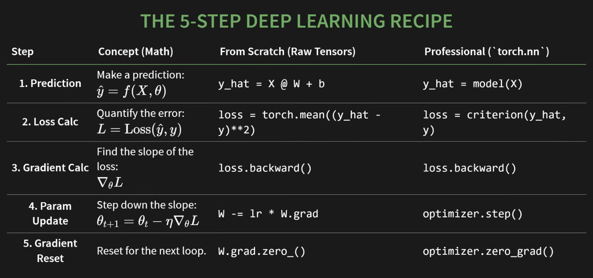

### learning from https://www.youtube.com/watch?v=r1bquDz5GGA

### Github ref: https://github.com/The-Pocket/PocketFlow-Tutorial-Video-Generator/blob/main/docs/llm/pytorch.md

### 3 lines of code:

```python
loss.backward()
optimizer.step()
optimizer.zero_grad()
```

Above code can train any neural network in the world. 

What we're learning are what's happening behind these 3 lines of code 

### 5 step Recipe: 



### The only data structure you need

`torch.tensor`

check `src/one.py` for implementation - Direct creationg from data 

check all other creation patterns for tensor in `src/one.py`

### Inside a tensor 
- shape, type and device 

#### Three critical attributes: 
- used constantly for debugging 

check `src/two.py`

##### Teminolgies:
- .shape: A tuple describing the dimensions. Your #1 debugging tool, **90%** of errors in PyTorch are shape mismatches 

- .device: Where the tensor lives. could be cpu or cuda (GPU)

- .dtype: The data type of the numbers. The default is float32 and this is not an accident
    - why? **cuz of gradients**
    - entire DL works on gradients and works by making tiny continuous adjustments to a model's weights. called as nudges, you cant nudge a parameter from number 3 to 3.001 if your data type only allows whole numbers so its impossible. And that tiny nudge, thats the **entire game**.

#### SIMPLE RULE: 
- Model parameters(weights, biases) MUST be a float type and float32 is the standard. 
- Data that represents categories or counts can be integers. 

#### Autograd or Automatic differntiation: Core Magic of PyTorch
- pytorch's built in gradient calculator and can be activated with simple switch i.e `requires_grad=True`

- By default, a tensor is just data so you need to tell pytorch that its a learnable parameter... so set the switch to `requires_grad=True`

(This is the most important setting in PyTorch)

IT SENDS A MESSAGE TO THE AUTOGRAD ENGINE:

"This is a parameter. From now on,
track *every single operation* that
happens to it."

check `three.py` for next 

when flipping the switch to True 
PyTorch begins to build a computation graph - think of it as a live recording of your operations 


